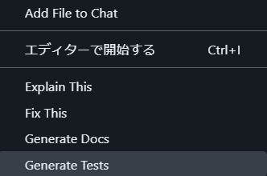
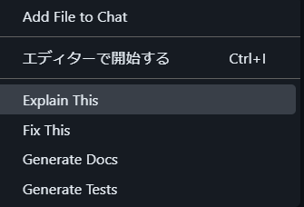

# GitHub Copilot Workshop (in progress...)

## Description

### Challenge 1: コード生成

予め与えられたプロンプトを使ってコードを生成します。

- [Challenge 1 コード](./app/src/main/java/org/example/challenge1/HelloCopilot.java)

#### Tips: コード候補に対するショートカット
|キー操作|内容|
|-------|----|
|`Tab`|候補の受け入れ|
|`Esc`|候補の拒否|
|`Ctrl` + `→`|候補を単語レベルで受け入れ|
|`Alt` + `]`|次の候補の表示|
|`Alt` + `[`|前の候補の表示|
|`Ctrl` + `Enter`|全ての候補の表示|

### Challenge 2: Copilot チャットからのコード生成

チャットウインドウでコード内容を説明し、コードを生成します。

コードの内容説明のサンプルは以下です。

```tedt
org.example.challenge2 パッケージに YourIdea.java というクラスを作ります。 このクラスで実施する内容は、現在の日時を日本のローカル時間、アメリカ西海岸時間、そしてイギリス時間を表示します。それぞれの日時の表示フォーマットは、日本式、アメリカ式、ヨーロッパ式とします。
```

Copilot チャットでコードが生成されたら、コードにカーソルを合わせて表示されるアイコンメニューから `新しいファイルに挿入する` を選択します。


#### Tips: Copilot チャット表示ショートカット

|キー操作|内容|
|-------|----|
|`Ctrl` + `Alt` + `i`|チャットビューの表示|
|`Ctrl` + `Shift` + `i`|クイックチャットの表示|

### Challenge 3: 既存コードの補完

既存のコードはフィールドのみ定義されています。このコードに Setter, Getter, それと toStoring メソッドを追加します。

- [Challenge 2 コード](./app/src/main/java/org/example/challenge3/Book.java)

コードを追加する場所にカーソルを合わせ、インラインチャットの表示を行い、次のプロンプトを参考に入力します。

```text
Setter, Getter 及び toString メソッドを追加してください。
```

#### Tips: Copilot インラインチャット表示ショートカット

|キー操作|内容|
|-------|----|
|`Ctrl` + `i`|インラインチャットの表示|

### Challenge 4: 既存コードからのテストコード生成

Challenge 4 でロジックを補完し作成したコードからテストコードを作成します。
コードを右クリックし、`Copilot` -> `Generate Tests` を選択します。




### Challenge 5: コンテキスト変数を用いた複数ファイル情報を用いたコード生成

GitHub Copilot にはハッシュ(`#`)を使用したコンテキスト変数があります。これは、Copilot との会話の中で意図的に伝えたい情報を変数として渡すものです。
これを利用して複数のファイルの情報をもとにコード生成に活かすことができます。

これまで作成している次のファイルをコンテキスト変数 `#file` を用いて会話にアタッチし、Challenge 3 で作成したエンティティクラスに対して操作を行うサービスクラスを作成します。

以下のようなプロンプトを作成して Copilot と会話をしてみてください。

```text
@workspace #file:Book.java #file:build.gradle.kts #file:BookService.java 軽量の Java インメモリデータベース、例えば Apache Derby を使用して Book エンティティの内容をデータベースを使って操作するサービスクラスを BookService に実装したい。
```

#### Tips: コンテキスト変数
|コンテキスト変数|内容|
|--------------|----|
|`#file`|選択したファイル|
|`#editor`|エディタの表示領域|
|`#selection`|エディタの選択箇所|
|`#terminalLastCommand`|ターミナルで最後に実行したコマンドと結果|
|`#terminalSelection`|ターミナルの選択箇所|

### Challenge 6: スラッシュコマンドを使用してコードの説明を取得

Challenge 5 で作成したコードの説明を **スラッシュコマンド**を使用してコード内容の説明を取得します。

- [Challenge 6 コード](./app/src/main/java/org/example/challenge5/BookService.java)

コードを右クリックし、`Copilot` -> `Explain This` を選択します。




#### Tips: スラッシュコマンド
|スラッシュコマンド|内容|
|----------------|----|
|`/explain`|コードの説明を取得|
|`/tests`|選んだコードの単体テストを作成|
|`/fix`|選んだコードの問題の修正プログラムを提案|
|`/new`|指定した質問に回答するコードを生成|
|`/newNotebook`|新しいJupyter Notebookを作成|
|`search`|VS Code の検索ビューのクエリパラメータを生成コマンドを検索して実行|
|`runCommand`|VS Code のコマンドを検索して実行|
|`/clear`|新しいチャットを開始|
|`/help`|ヘルプ|


## Demo

## Features

- feature:1
- feature:2

## Requirement

## Usage

## Installation

## References

## Licence

Released under the [MIT license](https://gist.githubusercontent.com/shinyay/56e54ee4c0e22db8211e05e70a63247e/raw/f3ac65a05ed8c8ea70b653875ccac0c6dbc10ba1/LICENSE)

## Author

- github: <https://github.com/shinyay>
- twitter: <https://twitter.com/yanashin18618>
- mastodon: <https://mastodon.social/@yanashin>
